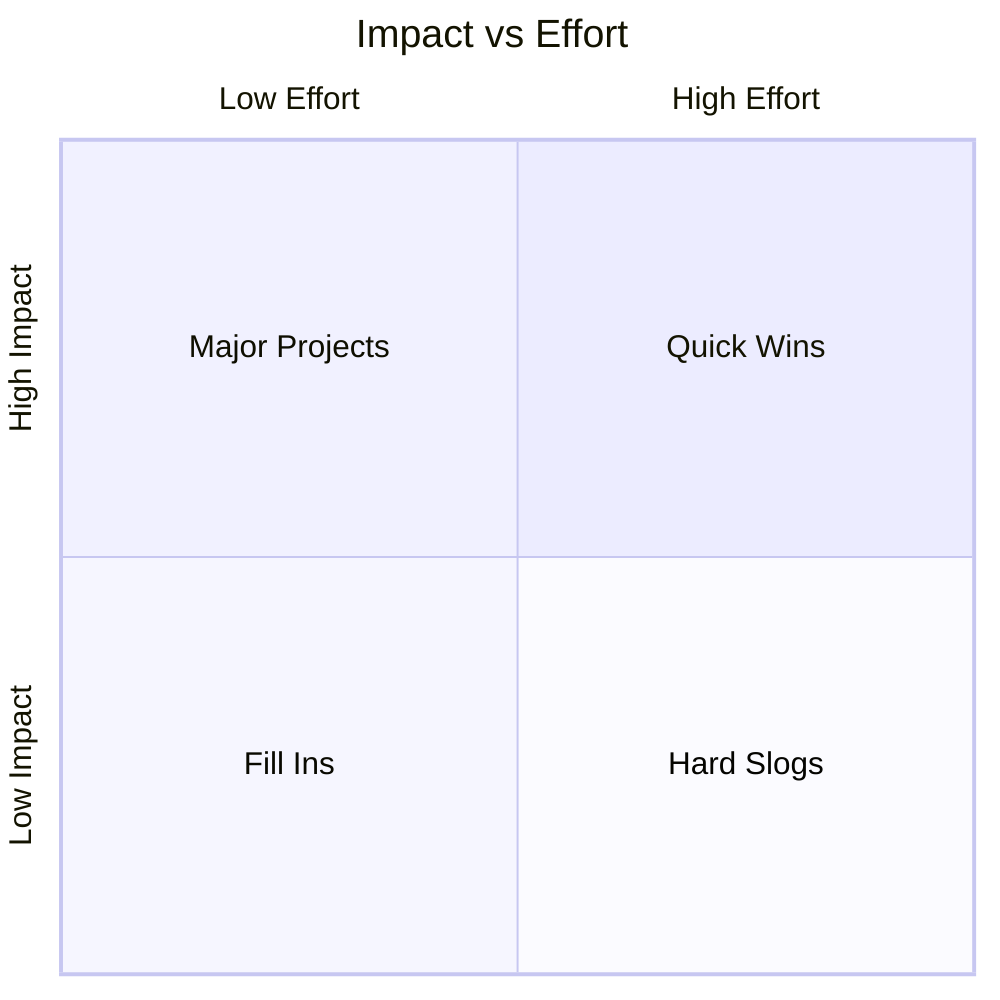

# Feature Prioritization Prompt

This prompt helps you prioritize features effectively for your SaaS application using a systematic approach combining the MoSCoW method with impact-effort analysis.

## Purpose
Systematically analyze and prioritize your application features to create a focused development roadmap.

## Input
- `features.md` - Your initial features document

## Steps

### 1. Provide your `features.md` file or list all potential features for your application
### 2. Include a brief description for complex features
### 3. Note any known dependencies or technical requirements
### 4. Run the prompt and analyze the results
### 5. Save the output as `feature-priorities.md` for the next step

## The Prompt

```md
I need help prioritizing features for my SaaS application. 

# Input
Please review the attached `features.md` and `market-opportunity.md` files.

Please help me analyze and prioritize these features using the following framework:

1. MoSCoW Analysis
    Categorize each feature as:
    * Must have (critical for MVP)
    * Should have (important but not critical)
    * Could have (desired but not necessary)
    * Won't have (out of scope for now)

2. Impact-Effort Matrix
    For each Must and Should have feature, analyze:
    * User Impact (High/Medium/Low)
    * Development Effort (High/Medium/Low)
    * Technical Risk (High/Medium/Low)
    * Dependencies

3. Consider Dependencies
    * Note any technical or functional dependencies
    * Identify integration requirements
    * Map feature relationships

4. Implementation Order
    Based on the above analysis:
    * Suggest an optimal implementation sequence
    * Identify quick wins (high impact, low effort)
    * Flag potential bottlenecks
    * Group features into logical development phases

Please provide reasoning for each categorization and any additional insights about feature dependencies or technical considerations.

MoSCoW Categories

1. **Must Have**
    * Core features essential for the MVP
    * Features without which the product cannot function
    * Basic security and data protection features

2. **Should Have**
    * Important features that add significant value
    * Features that can be temporarily worked around
    * Improvements to core functionality

3. **Could Have**
    * Nice-to-have features
    * Features that would improve user experience
    * Additional customization options

4. **Won't Have**
    * Features outside the current scope
    * Future considerations
    * Features with low value-to-effort ratio

Impact-Effort Quadrants



## Output
The final prioritized feature list will be saved as `feature-priorities.md` for use in creating the PRD.

## Refinement Process

After initial prioritization:

1. **Validate with Stakeholders**
    * Prioritize based on user value and business impact
    * Consider user feedback and market demands
    * Focus on core user needs

    ```prompt
    Based on the prioritization, here are the key questions for stakeholders:
    [List specific questions about priority decisions]
    ```

2. **Technical Feasibility Check**

    * Consider your team's capabilities and resources
    * Account for learning curves and training
    * Plan for contingencies 

    ```prompt
    For the high-priority features, please analyze technical feasibility and identify potential challenges:
    [List high-priority features]
    ```

1. **Think Long-term**

    * Consider future scalability and maintenance
    * Plan for platform growth
    * Account for technical debt

    ```prompt
    Given our prioritized feature list, please suggest resource allocation and timeline estimates for:
    [List prioritized features]
    ```


## Next Steps
After generating `feature-priorities.md`, proceed to [MVP Validation](./mvp-validation.md).